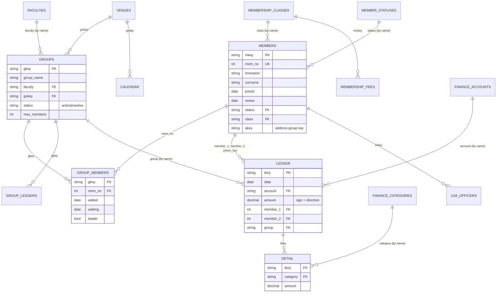

# Beacon Backup `.xlsx` — Data Structure Reference

> **Audience:** AI agents (Claude / Codex) building **Analyse u3a** — a local-only
> analysis app that ingests a Beacon backup `.xlsx` produced by the original
> Beacon system used by u3a branches in the UK.
>
> **Source of truth:** This document is reverse-engineered from
> `backend/src/routes/backup.js` (function `restoreBeacon`, lines 1214–1729) in
> the **Beacon2** repository, and verified against a real backup file:
> `docs/FromBeacon/202603170140_St Ives Cambridge Demo24 u3abackup.xlsx`.
>
> If you find a discrepancy between this document and the actual xlsx file,
> **the xlsx file wins** — please update this doc.

---

## 1. The file at a glance

A Beacon backup is a single `.xlsx` (Excel Open XML) workbook. It is produced
by the legacy **Beacon** PHP application's "Backup" feature. Each worksheet in
the workbook represents one logical entity ("table"). Row 1 of every sheet
contains column headers; data starts at row 2.

The full backup has 23 sheets. The subset relevant to **Analyse u3a** is:

| # | Sheet name (verbatim) | Logical entity | Used in analysis for |
|---|----------------------|----------------|----------------------|
| 1 | `Member Statuses` | Member status lookup | Active/lapsed segmentation, churn |
| 2 | `Membership Classes` | Membership class lookup | Single/joint/associate breakdown |
| 3 | `Membership Fees` | Per-class monthly fee schedule | Expected renewal income |
| 4 | `Members` | Members (people) | All membership analyses |
| 5 | `Faculties` | Group categories | Group popularity by faculty |
| 6 | `Venues` | Where groups meet | Venue utilisation |
| 7 | `Groups` | Interest groups | Group popularity, capacity |
| 8 | `Group members` | Membership of each group | Group popularity, member engagement |
| 9 | `Group Ledgers` | Group-level cash transactions | Group financial activity |
| 10 | `Calendar` | u3a-wide events ("open meetings") | Event programme, attendance proxy |
| 11 | `Finance Accounts` | Bank/cash accounts | Transaction categorisation |
| 12 | `Finance Categories` | Income/expense categories | **Renewal payments** identified here |
| 13 | `Ledger` | Financial transactions | Renewal payment tracking |
| 14 | `Detail` | Transaction line items (split across categories) | Renewal vs. other income |
| 15 | `u3a Officers` | Committee / contact roles | Contact directory |

Sheets **not** used by Analyse u3a (but present in the file): `Roles`,
`Privileges`, `System Users`, `Polls`, `Poll assignments`, `System Messages`,
`Site Settings 1`, `Site Settings 2`. Skip these unless the user asks for them.

> **NB on attendance:** Legacy Beacon does **not** record per-member, per-event
> attendance. There is no attendance sheet. "Attendance patterns" can only be
> inferred from `Group members` (current membership of a group, with
> `waiting` and `added` dates) and from the `Calendar` sheet (events held).
> Surface this limitation to the user — don't fabricate attendance.

---

## 2. Key conventions used throughout the file

**String keys.** Every entity has a string primary key in the export — `mkey`
for members, `gkey` for groups, `gvkey` for venues, etc. These are NOT UUIDs;
they are short tokens generated by Beacon (e.g. `m_001`, `g_007`). They are
unique within their sheet but have no meaning outside the file. Foreign keys
in other sheets reference these.

**Three foreign-key resolution patterns** are used in the file. Knowing which
one applies to a given column is essential:

| Pattern | Example | How to resolve |
|---------|---------|----------------|
| **By string key** | `Group members.gkey → Groups.gkey` | Direct join on the key column |
| **By name (case-insensitive)** | `Groups.faculty → Faculties.faculty` | Lowercase both sides and match |
| **By membership number** | `Ledger.member_1 → Members.mem_no` | Join on `mem_no` (an integer) |

The `Members` sheet has **two** identifiers: `mkey` (string) and `mem_no`
(integer membership number). Different sheets reference members differently —
e.g. `Group members` uses `mem_no`, `u3a Officers` uses `mkey`,
`Poll assignments` uses both. See each sheet's section below.

**Dates.** Cells may be Excel date serials, ISO strings (`YYYY-MM-DD`), or
UK-style strings (`DD/MM/YYYY`). Always parse defensively.

**Booleans.** Stored as `0` / `1` (sometimes `'true'` / `'false'`). Any value
that is `1`, `'1'`, `true`, or `'true'` (case-insensitive) is true; everything
else is false. Empty cells = false.

**Decimals.** Money columns are decimals (e.g. `12.50`). Empty / non-numeric
cells should become `null`, not `0`.

**Empty strings.** Blank cells should be treated as `null`, not as empty
strings — this matters for FK lookups.

**Transaction sign convention.** In `Ledger.amount`: positive = income (money
in), negative = expense (money out). Store the absolute value plus a `type`
field (`'in'` or `'out'`).

---

## 3. Entity-relationship overview

Arrows point from the parent (one) side to the child (many) side. The label is
the column in the child sheet that holds the FK and how it is resolved.

---

## 4. Per-sheet column reference

Each section below lists the columns in the order they appear in the xlsx,
their type, whether they are nullable, and notes. Column names are **verbatim**
— preserve case, hyphens, slashes, and spaces exactly. Use bracket notation
in TypeScript for awkward names (e.g. `row['e-mail']`, `row['date/time']`).

The reference is split into sub-files for readability:

- [`./BEACON-DATA-MEMBERS.md`](./BEACON-DATA-MEMBERS.md) — Members, Member Statuses, Membership Classes, Membership Fees
- [`./BEACON-DATA-GROUPS.md`](./BEACON-DATA-GROUPS.md) — Groups, Faculties, Venues, Group members, Group Ledgers, Calendar
- [`./BEACON-DATA-FINANCE.md`](./BEACON-DATA-FINANCE.md) — Finance Accounts, Finance Categories, Ledger, Detail
- [`./BEACON-DATA-CONTACTS.md`](./BEACON-DATA-CONTACTS.md) — u3a Officers

---

## 5. Recommended ingestion pipeline

Suggested order to load sheets so FKs always resolve forward:

1. `Member Statuses` → build `statusByName` map (lowercase name → row)
2. `Membership Classes` → build `classByMckey` and `classByName`
3. `Membership Fees` → join on `mckey`
4. `Faculties` → build `facultyByGfkey` and `facultyByName`
5. `Venues` → build `venueByGvkey`
6. `Members` → build `memberByMkey` AND `memberByNo` (you need both)
7. `Groups` → build `groupByGkey` and `groupByName`
8. `Group members` → resolve `gkey` → group, `mem_no` → member
9. `Group Ledgers` → resolve `gkey` → group
10. `Calendar` → resolve `gvkey` → venue
11. `Finance Accounts` → build `accountByName`
12. `Finance Categories` → build `categoryByName`
13. `Ledger` → resolve `account`, `member_1`, `member_2`, `group` (all by name / mem_no)
14. `Detail` → resolve `tkey` → transaction, `category` → category by name
15. `u3a Officers` → resolve `mkey` → member

---

## 6. Identifying renewal payments

There is no `is_renewal` flag. Renewal income is identified by **transaction
category**: a row in `Detail` whose `category` matches a category whose name
contains "subscription", "renewal", or similar (varies by u3a). The matching
`Ledger` row is the actual payment; `Detail.amount` is the renewal portion of
that transaction.

Heuristic recommended for the new app:

1. Let the user pick which `Finance Categories` count as "renewal income"
   (default: any category whose name matches `/subscr|renew|member.*fee/i`).
2. For each `Detail` row whose `category` matches, fetch the parent `Ledger`
   row and the linked `member_1` (and `member_2` if present).
3. Aggregate by year of `Ledger.date` to get renewal payment counts and totals.

A `Ledger` row may have `member_1` and `member_2` populated for a joint
membership — count both members but split the amount evenly unless the user
configures otherwise.

---

## 7. Identifying churn

Beacon does not store a "left on" date. Churn is inferred by:

- `Members.status` matching a status whose `locked = 1` (typically "Resigned",
  "Lapsed", or similar — check `Member Statuses` for the actual names in the
  imported file).
- A member who appears in `Members` but no longer in `Group members` for any
  active group is likely disengaged (not necessarily churned).
- Lapsed renewal: `Members.renew` (next renewal date) is in the past. Combined
  with the absence of a recent renewal `Ledger` entry, this indicates churn.

---

## 8. Sample data

A real example backup is at:
`docs/FromBeacon/202603170140_St Ives Cambridge Demo24 u3abackup.xlsx` (in the
Beacon2 repo, not copied here — files containing real member data must not
leave the local machine).

For unit tests, create a small synthetic xlsx fixture rather than copying the
real one.

---

## 9. JSON Schema and Zod schemas

Programmatic contracts for each sheet:

- `schemas/json/*.schema.json` — JSON Schema (Draft 2020-12), one per sheet,
  for runtime validation of parsed rows
- `schemas/zod/*.ts` — Zod schemas, one per sheet, for type-safe parsing in
  TypeScript

The Zod schemas export both the schema (for `.parse()` / `.safeParse()`) and
the inferred TypeScript type (`MembersRow`, `GroupsRow`, etc.) so the new app
can use them as the single source of truth.
